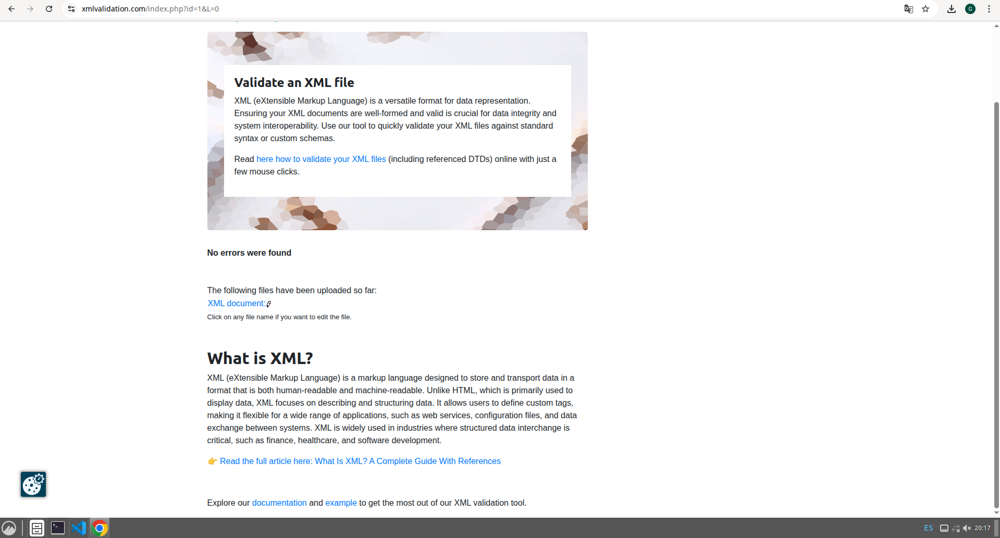
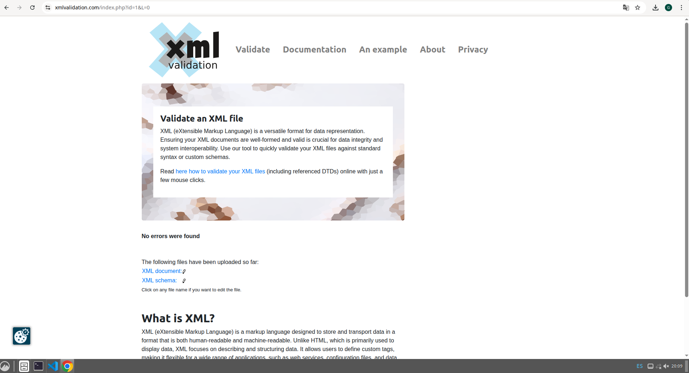

# Validación del archivo alcoholes.xml

## 1. Herramientas utilizadas

### Validación DTD
- **Herramienta:** [xmlvalidation.com](https://www.xmlvalidation.com/)
- **Versión:** XML 1.0 (W3C Standard).

### Validación XSD
- **Herramienta:** Visual Studio Code (Extensión: XML de Red Hat) / [xmlvalidation.com](https://www.xmlvalidation.com/)
- **Versión:** XML Schema 1.1.

## 2. Proceso de validación

### Validación contra DTD
**Comando/Pasos ejecutados:**
1. Se definió el archivo `tienda.dtd` estableciendo una estructura jerárquica rígida donde el orden de los elementos es: `rones`, `Whiskey`, `Licores_Gallegos` (opcional) y `ginebra`.
2. Se utilizó la declaración `<!DOCTYPE tienda_alcohol SYSTEM "tienda.dtd">` para vincular el documento XML con su definición de tipo.
3. Se verificó que los atributos `precio` y `disponible` se aplicaran correctamente a cada marca mediante el uso de entidades paramétricas (`%attrs;`).
4. Se comprobó la validez del documento asegurando que no existieran elementos fuera del orden secuencial definido.

## 3. Proceso de validación

### Validación contra XSD
**Comando/Pasos ejecutados:**
1. Se creó el esquema `Tienda_Alcohol.xsd` migrando la lógica del DTD a tipos complejos (`xs:complexType`) y aplicando restricciones de datos (facetas).
2. Se vinculó el XML mediante los atributos de instancia:
   - `xmlns:xsi="http://www.w3.org/2001/XMLSchema-instance"`
   - `xsi:noNamespaceSchemaLocation="Tienda_Alcohol.xsd"`
3. Se realizaron pruebas de error forzadas (introduciendo precios sin el símbolo "€" o disponibilidades en minúsculas) para confirmar que el motor de validación rechazaba los datos incorrectos.
4. Se validó el documento final obteniendo el mensaje "No errors found".

## 5. Decisiones de diseño

### ¿Por qué usar elementos vs atributos?
Se ha optado por una estructura semántica donde el **elemento** representa la entidad principal y el **atributo** representa sus propiedades técnicas:
- **Elementos para las marcas:** Se han definido las marcas (ej. `<Barcelo>`, `<Beefeater>`) como elementos porque contienen la información principal (la descripción del producto). Esto permite que el contenido sea flexible y facilita la legibilidad humana.
- **Atributos para metadatos:** El `precio` y la `disponibilidad` se definieron como atributos. Al ser datos breves, de tipo técnico y de estructura fija, los atributos permiten aplicar restricciones de validación más potentes en el XSD sin interferir con el texto descriptivo del producto.

### Restricciones XSD aplicadas

1. **Restricción tipoPrecioTexto (Pattern): `[0-9]+(\.[0-9]{2})?€`**
   - **Justificación:** Se utiliza una expresión regular para garantizar que el precio cumpla siempre el formato económico europeo. Esto evita que se introduzcan caracteres no numéricos y asegura que el símbolo de la moneda esté siempre presente.

2. **Restricción tipoDisponibilidad (Enumeration): `TRUE` / `FALSE`**
   - **Justificación:** Se limita el valor a dos opciones fijas en mayúsculas. Esto garantiza la integridad de los datos de inventario, impidiendo que variaciones como "si", "no", "true" (minúscula) o celdas vacías rompan la lógica del negocio.

3. **Restricción tipoDescripcion (MinLength): `10`**
   - **Justificación:** Se establece una longitud mínima para el texto descriptivo. El objetivo es asegurar que el catálogo contenga información de calidad para el cliente, evitando descripciones vacías o demasiado breves que no aporten valor.